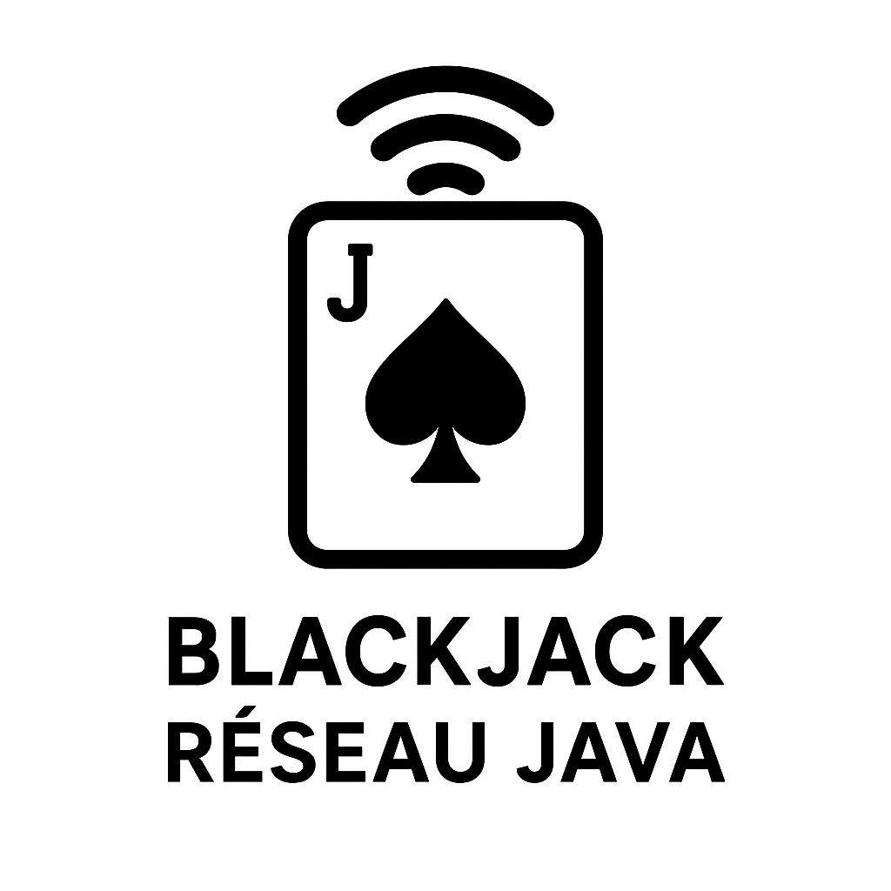

# Blackjack Réseau en Java



Un petit projet de **Blackjack multijoueur** en Java permettant à plusieurs clients de se connecter à une même table et de jouer contre un robot (croupier).

## Fonctionnalités
- Jeu en réseau (serveur + plusieurs clients)
- Chaque client choisit son pseudo
- Affichage clair :
  - Robot : valeur + cartes
  - Chaque joueur : pseudo + valeur + cartes
- Commandes simples :
  - `T` pour tirer
  - `R` pour rester

## Lancement
1. Compiler tous les fichiers :
   ```bash
   javac *.java
   ```

2. Lancer le serveur (par exemple sur le port 5000) :
   ```bash
   java Server 5000
   ```

3. Lancer un ou plusieurs clients :
   ```bash
   java Client localhost 5000
   ```

## Exemple d’affichage
```
-----------------
Robot: AS de COEUR, HUIT de PIQUE (19)
Alice: DIX de CARREAU, SEPT de TREFLE (17)
Bob: ROI de PIQUE, SIX de COEUR (16)
-----------------
```

---
